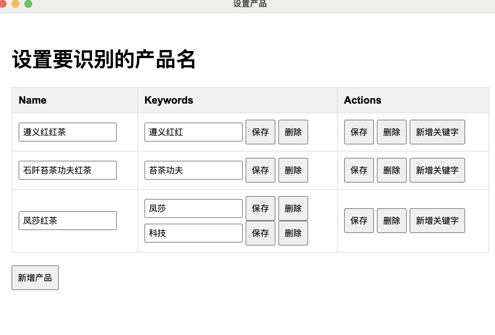

# 截图对单工具使用帮助

## 1.配置产品名和其他（只是为了更精准识别产品名）

   点击菜单->配置->产品名，注意以第一匹配到的关键词的，作为产品名
   
   品名+实付款 --分类copy图片到相关目录精确
   配置后，图片归类到目录更准确

## 保存截图到目录
  将需要识别的图片保存到电脑文件目录（可以有多个子文件夹），注意名output的会被忽略，用来保存结果

## 运行程序
   打开程序，运行，等待完成后，检查数据

## 如何检查数据
  1. 打开ocr.xlsx选中表头，菜单 数据  自动筛选
  2. 高亮重复项手机号，检查所有手机号重复的记录或为空的记录
  3. 检查实付款字段，统计每个总价的全部订单数
  4. 检查商品名，包含商品名是否和检查的一直
  5. 根据归属筛选图片，发给对应厂商
  6. 没有按归属区分的记录需要人工处理
