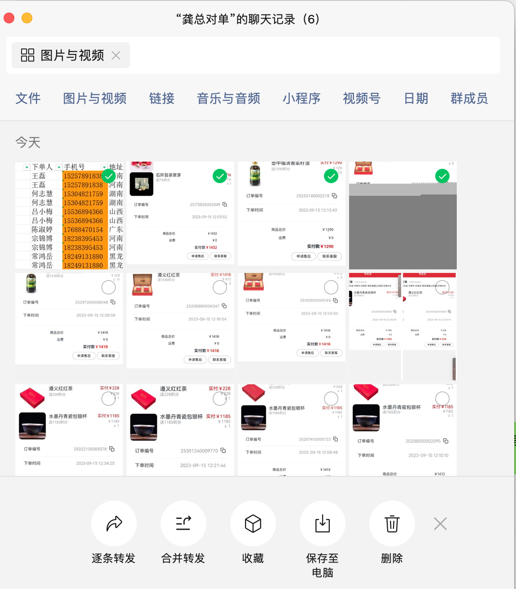
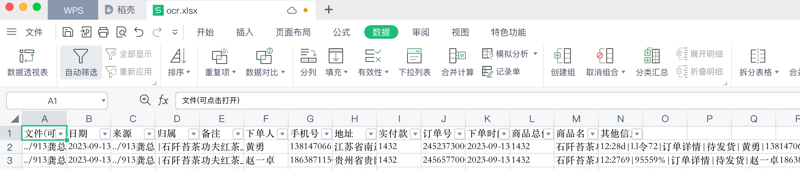

# 保存微信聊天记录图片到电脑

  找到电脑版微信设置，迁移与备份，打开
  将手机和电脑连到同一wifi，手机微信上选择要同步的聊天记录

  将同步的聊天记录，选择聊天记录管理，
  保存到电脑

# 运行 
  
 1. cp apiConfig.example.js  apiConfig.js，
 2. 配置api参数apiConfig.js，
 3. 配置需精准识别品名的商品名apiConfig.js，
    1. apiConfig.js， products，配置要精准识别的产品名称

 注意子目录output默认当成识别结果目录，不会被处理
 输出文件在output下
  ocr.xlsx  -- 所有数据汇总，需要加筛选功能后人工检测识别异常数据
  cp      -- 按产品分类 目录
    品名+实付款 --分类copy图片到相关目录

# 如何检查数据
  1. 打开ocr.xlsx选中表头，菜单 数据  自动筛选
   
  2. 高亮重复项手机号，检查所有手机号重复的记录或为空的记录
  3. 检查实付款字段，统计每个总价的全部订单数
  4. 检查商品名，包含商品名是否和检查的一直
  5. 根据归属筛选图片，发给对应厂商
  6. 没有按归属区分的记录需要人工处理

# txyocr

在输出目录下,将截图目录扁平化建立目录,将识别结果写入该目录下ocr.xlst,ocr.csv
出错的文件写入 ocr.csv.err
node ${__filename} 713龚洋/test bd pt 
结果写入  ${__dirname}/output/713龚洋_test
 node ${__filename} 目录 方法 输出目录 处理子目录层级
  截图目录       ---   截图所在目录
  平台          ---   bd(百度) tx（腾讯) (默认bd)
  方法          ---   acc(高精度) pt(普通)  ptl(标准+位置) accl(高精+位置) (默认pt)
  输出目录       ---   输出结果目录（默认 截图目录/output）
  处理子目录层级  ---   默认 2
